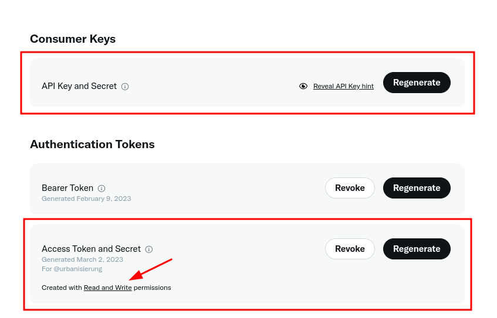
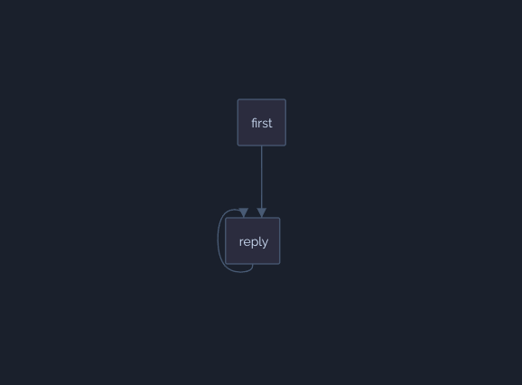
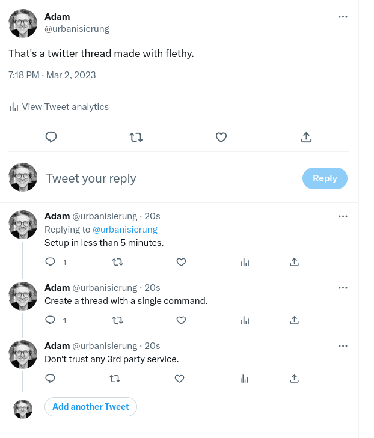

# Building your own Twitter Thread Generator

Twitter threads have become quite popular. A lot of information can be packed into one thread, and in my opinion, Twitter threads are quite enjoyable to read.

As a prerequisite, you need a Twitter Developer account. With a Twitter account, it's easy: navigate to https://developer.twitter.com and register a new app. Make sure that you create a Twitter app that has read and write permissions!



You need the following credentials for the flow to work:

- API Key and Secret
- Access Token and Secret

Now it gets a little technical, but not too much. The following flethy flow creates your Twitter thread:

```json
[
  {
    "id": "first",
    "next": [
      {
        "id": "reply",
        "condition": {
          "filter": "$count(context.input.thread) > 1"
        }
      }
    ],
    "config": {
      "namespace": "tweet",
      "postAssignments": [
        {
          "namespace": "thread",
          "key": "counter",
          "valueToEvaluate": "$number(1)"
        }
      ]
    },
    "kind": "twitter.manage.postTweets",
    "auth:Authorization": {
      "consumerKey": "==>secrets==>CONSUMER_KEY",
      "consumerSecret": "==>secrets==>CONSUMER_SECRET",
      "accessKey": "==>secrets==>ACCESS_TOKEN",
      "accessSecret": "==>secrets==>ACCESS_TOKEN_SECRET"
    },
    "body:text": "->context.input.thread[0]->string"
  },
  {
    "id": "reply",
    "next": [
      {
        "id": "reply",
        "condition": {
          "filter": "$number(context.thread.counter) < $count(context.input.thread)"
        }
      }
    ],
    "config": {
      "namespace": "tweet",
      "postAssignments": [
        {
          "namespace": "thread",
          "key": "counter",
          "valueToEvaluate": "$number(context.thread.counter) + 1"
        }
      ]
    },
    "kind": "twitter.manage.postTweets",
    "auth:Authorization": {
      "consumerKey": "==>secrets==>CONSUMER_KEY",
      "consumerSecret": "==>secrets==>CONSUMER_SECRET",
      "accessKey": "==>secrets==>ACCESS_TOKEN",
      "accessSecret": "==>secrets==>ACCESS_TOKEN_SECRET"
    },
    "body:text": "->context.input.thread[$$.context.thread.counter]->string",
    "body:reply": {
      "in_reply_to_tweet_id": "->context.tweet.data.id->string"
    }
  }
]
```

Represented as a graph, it looks like this:



To best explain the process to you, I will briefly show you the payload that you can use to start the process:

```json
{
  "input": {
    "thread": [
      "That's a twitter thread made with flethy.",
      "Setup in less than 5 minutes.",
      "Create a thread with a single command.",
      "Don't trust any 3rd party service."
    ]
  }
}
```

The process essentially does the following:

1. Create a tweet with the first element from the array. Here: `That's a twitter thread made with flethy.`
2. Write a new variable called `counter` and initialise it with the value `1`. This gives us a condition for the loop we are going to run through.
3. If the array contains more than one element go to the next node `reply`.
4. Create a tweet as a reply to the last tweet and increment the counter.
5. If the counter is less than the number of elements, execute the node `reply` again, otherwise we are done.

Actually quite simple!

You can now easily start this flow with the typescript package `@flethy/flow`:

```ts
import { FlowEngine } from "@flethy/flow";

const flow = {}; // flow from above
const input = { input: thread: [] }; // input from above

async function main() {
  const engine = new FlowEngine({
    env: {
      env: {},
      secrets: {
        CONSUMER_KEY: process.env.CONSUMER_KEY,
        CONSUMER_SECRET: process.env.CONSUMER_SECRET,
        ACCESS_TOKEN: process.env.ACCESS_TOKEN,
        ACCESS_TOKEN_SECRET: process.env.ACCESS_TOKEN_SECRET,
      },
    },
    flow,
    input,
  });
  await engine.start();
}

main()
```

That's all you need to create a Twitter thread locally in a Typescript project.

Of course, it is more comfortable in the cloud. You don't have to set up anything, set any environment variables or write any code. The following video shows you how it works:

<iframe width="100%" height="500" src="https://www.youtube.com/embed/b3TJK7PYQ58" title="YouTube video player" frameborder="0" allow="accelerometer; autoplay; clipboard-write; encrypted-media; gyroscope; picture-in-picture; web-share" allowfullscreen></iframe>

And at the end you'll receive your tweet :)


