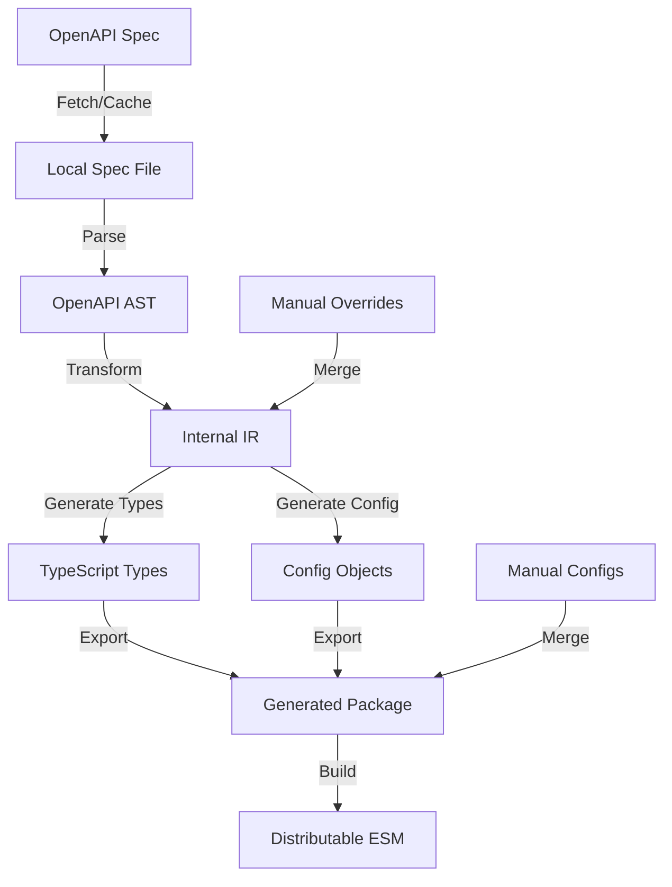

# @flethy/connectors - Rebuild Proposal & Architecture Analysis

**Author:** GitHub Copilot Analysis  
**Date:** 2025-12-10  
**Status:** Proposal for Review

---

## Executive Summary

This document provides a comprehensive analysis of the current `@flethy/connectors` package and proposes a modernized rebuild strategy that leverages OpenAPI specifications for automatic type generation, reduces manual effort, maintains zero dependencies, and provides an excellent developer experience.

**Current State:**
- 310+ API connectors manually implemented
- ~1.7MB built package size
- Manual TypeScript interface definitions for each endpoint
- Zero runtime dependencies (✅ maintained)
- Functional but requires significant manual effort to add/update connectors

**Proposed State:**
- OpenAPI-driven automatic type and config generation
- Reduced manual effort by 70-80%
- ESM-first, tree-shakeable package
- Improved bundle size through better tree-shaking
- Automated validation and testing
- MCP (Model Context Protocol) integration ready

---

## 1. Current Architecture Analysis

### 1.1 Structure Overview

```
packages/connectors/
├── src/
│   ├── configs/          # 310+ manual config files (~80-400 lines each)
│   │   ├── github.config.ts
│   │   ├── stripe.config.ts
│   │   └── ...
│   ├── types/            # Core type definitions
│   │   ├── ApiDescription.type.ts
│   │   ├── FetchParams.type.ts
│   │   └── Request.types.ts
│   ├── utils/            # Request builder utilities
│   │   ├── Request.utils.ts
│   │   ├── Config.utils.ts
│   │   └── OAuth1a.utils.ts
│   ├── templates/        # Template for new configs
│   └── index.ts          # Main export (310+ exports)
└── package.json
```

### 1.2 Current Implementation Pattern

Each API connector follows this manual pattern:

```typescript
// Example: github.config.ts
export namespace Github {
  // Manual type definitions
  export interface ListRepositoryIssues extends RequestParams {
    kind: 'github.issues.listrepository'
    'param:owner': string
    'param:repo': string
    'auth:Authorization'?: string
    'query:milestone'?: string | number
    'query:state'?: 'open' | 'closed' | 'all'
    // ... more params
  }

  // Manual API description
  export const API: ApiDescription<Entity, Endpoint> = {
    meta: { id: 'github', name: 'Github', ... },
    base: 'https://api.github.com',
    auth: { Authorization: { type: 'header:bearer' } },
    api: {
      issues: {
        listrepository: {
          interface: 'ListRepositoryIssues',
          meta: { title: '...', description: '...', docs: '...' },
          method: 'GET',
          paths: [{ name: 'repos', type: 'static' }, ...]
        }
      }
    }
  }
}
```

### 1.3 Key Pain Points

#### High Manual Effort
- **Problem:** Each endpoint requires manual TypeScript interface definition
- **Impact:** Adding GitHub's 200+ endpoints would require weeks of manual work
- **Evidence:** Current configs range from 50-450 lines, mostly boilerplate

#### Maintenance Burden
- **Problem:** API changes require manual updates across interfaces and configs
- **Impact:** Outdated types, missed parameter changes, documentation drift
- **Example:** When Stripe adds a new query parameter, it must be manually added

#### Limited Coverage
- **Problem:** Only 1-5 endpoints per service (out of potentially 50-200)
- **Impact:** Users must manually construct requests for uncovered endpoints
- **Evidence:** GitHub has 4 endpoints vs 200+ available

#### No Validation
- **Problem:** No automated way to verify configs match actual API specs
- **Impact:** Runtime errors, incorrect types, broken integrations
- **Risk:** Silent failures when APIs change

#### Difficult Testing
- **Problem:** No test infrastructure for validating request building
- **Impact:** Regressions can slip through, low confidence in changes

### 1.4 Current Strengths (Must Preserve)

✅ **Zero Dependencies:** Core value proposition  
✅ **Type Safety:** Full TypeScript typing  
✅ **HTTP Client Agnostic:** Works with fetch, axios, got, etc.  
✅ **Functional API:** Simple `nao()` function for request building  
✅ **Rich Metadata:** Service info, docs links, pricing, social  
✅ **Auth Abstraction:** Handles Bearer, Basic, OAuth1a, API keys, etc.

---

## 2. Proposed Architecture

### 2.1 Core Principles

1. **OpenAPI First:** Use OpenAPI specs as source of truth
2. **Zero Dependencies:** Maintain for runtime, allow dev dependencies for generation
3. **ESM Native:** Pure ESM package with proper tree-shaking
4. **Automated Generation:** 70-80% of code auto-generated
5. **Progressive Enhancement:** Start with automation, allow manual overrides
6. **MCP Ready:** Structure supports Model Context Protocol integration

### 2.2 New Directory Structure

```
packages/connectors/
├── scripts/                    # Build-time only
│   ├── generators/
│   │   ├── openapi-to-config.ts      # OpenAPI → Config generator
│   │   ├── types-generator.ts         # Type generation
│   │   └── index-generator.ts         # Auto-generate exports
│   ├── validators/
│   │   ├── config-validator.ts        # Validate generated configs
│   │   └── schema-validator.ts        # Validate against OpenAPI
│   └── utils/
│       ├── openapi-fetcher.ts         # Fetch specs from URLs
│       └── cache-manager.ts           # Cache specs locally
├── specs/                      # OpenAPI specifications
│   ├── github.yaml             # Fetched/cached OpenAPI specs
│   ├── stripe.yaml
│   ├── manual/                 # Manual specs for APIs without OpenAPI
│   │   └── web3storage.yaml
│   └── overrides/              # Manual overrides/extensions
│       └── github.overrides.yaml
├── src/
│   ├── generated/              # Auto-generated (git-ignored or committed)
│   │   ├── configs/
│   │   │   ├── github.config.ts
│   │   │   └── stripe.config.ts
│   │   └── types/
│   │       ├── github.types.ts
│   │       └── stripe.types.ts
│   ├── runtime/                # Core runtime (zero dependencies)
│   │   ├── request-builder.ts  # Core request building logic
│   │   ├── auth-handlers.ts    # Auth type handlers
│   │   └── types.ts            # Base types
│   ├── manual/                 # Manual configs (fallback/overrides)
│   │   └── custom-service.config.ts
│   ├── index.ts                # Auto-generated main export
│   └── mcp.ts                  # MCP integration exports
├── tests/
│   ├── unit/
│   │   ├── request-builder.test.ts
│   │   └── auth-handlers.test.ts
│   ├── integration/
│   │   └── generated-configs.test.ts
│   └── fixtures/
│       └── sample-requests.ts
├── connectors.config.json      # Configuration for generators
└── package.json
```

### 2.3 Generator Configuration

```json
// connectors.config.json
{
  "version": "1.0.0",
  "generators": {
    "outputDir": "src/generated",
    "templateDir": "scripts/templates",
    "cleanBeforeGenerate": true
  },
  "connectors": [
    {
      "id": "github",
      "name": "GitHub",
      "spec": {
        "type": "url",
        "url": "https://raw.githubusercontent.com/github/rest-api-description/main/descriptions/api.github.com/api.github.com.json",
        "cache": true
      },
      "overrides": "specs/overrides/github.overrides.yaml",
      "metadata": {
        "category": "versioncontrol",
        "type": "hosted",
        "tags": ["web2"],
        "pricing": "https://github.com/pricing",
        "social": {
          "twitter": "github"
        }
      }
    },
    {
      "id": "stripe",
      "name": "Stripe",
      "spec": {
        "type": "url",
        "url": "https://raw.githubusercontent.com/stripe/openapi/master/openapi/spec3.json",
        "cache": true
      },
      "metadata": {
        "category": "finance",
        "type": "payment",
        "tags": ["web2"]
      }
    },
    {
      "id": "web3storage",
      "name": "Web3Storage",
      "spec": {
        "type": "file",
        "path": "specs/manual/web3storage.yaml"
      },
      "metadata": {
        "category": "storage",
        "type": "ipfs",
        "tags": ["web3"]
      }
    }
  ]
}
```

### 2.4 Generation Workflow



### 2.5 Code Generation Strategy

#### Phase 1: Type Generation (from OpenAPI)

```typescript
// Auto-generated from OpenAPI spec
// src/generated/types/github.types.ts

export namespace GitHub {
  // Extracted from OpenAPI components/schemas
  export interface Issue {
    id: number
    title: string
    state: 'open' | 'closed'
    labels: Label[]
    // ... auto-generated from schema
  }

  // Extracted from OpenAPI paths
  export interface ListIssuesParams {
    owner: string
    repo: string
    state?: 'open' | 'closed' | 'all'
    labels?: string
    sort?: 'created' | 'updated' | 'comments'
    direction?: 'asc' | 'desc'
    since?: string
    per_page?: number
    page?: number
  }

  export interface ListIssuesResponse {
    data: Issue[]
    // ... pagination info
  }
}
```

#### Phase 2: Config Generation

```typescript
// Auto-generated from OpenAPI spec
// src/generated/configs/github.config.ts

import { APIConfig, Endpoint } from '../../runtime/types'
import * as Types from '../types/github.types'

export const GitHubConfig: APIConfig = {
  id: 'github',
  name: 'GitHub',
  baseUrl: 'https://api.github.com',
  
  // Auto-detected from OpenAPI security schemes
  auth: {
    type: 'bearer',
    header: 'Authorization'
  },

  // Auto-generated from OpenAPI paths
  endpoints: {
    'issues.list': {
      method: 'GET',
      path: '/repos/{owner}/{repo}/issues',
      parameters: {
        path: ['owner', 'repo'],
        query: ['state', 'labels', 'sort', 'direction', 'since', 'per_page', 'page']
      },
      types: {
        params: 'GitHub.ListIssuesParams',
        response: 'GitHub.ListIssuesResponse'
      }
    }
  }
}

// Helper functions (auto-generated)
export function listIssues(params: Types.ListIssuesParams) {
  return buildRequest(GitHubConfig, 'issues.list', params)
}
```

#### Phase 3: Runtime (Zero Dependencies)

```typescript
// src/runtime/request-builder.ts

export interface RequestConfig {
  method: string
  url: string
  headers?: Record<string, string>
  body?: any
}

export function buildRequest(
  apiConfig: APIConfig,
  endpointId: string,
  params: any
): RequestConfig {
  const endpoint = apiConfig.endpoints[endpointId]
  
  // Build URL with path params
  let url = apiConfig.baseUrl + endpoint.path
  for (const [key, value] of Object.entries(params)) {
    url = url.replace(`{${key}}`, String(value))
  }
  
  // Build query string
  const queryParams = new URLSearchParams()
  for (const key of endpoint.parameters.query || []) {
    if (params[key] !== undefined) {
      queryParams.append(key, String(params[key]))
    }
  }
  if (queryParams.toString()) {
    url += '?' + queryParams.toString()
  }
  
  // Build headers with auth
  const headers: Record<string, string> = {}
  if (apiConfig.auth && params.auth) {
    headers[apiConfig.auth.header] = formatAuth(apiConfig.auth.type, params.auth)
  }
  
  return {
    method: endpoint.method,
    url,
    headers,
    body: endpoint.method !== 'GET' ? params.body : undefined
  }
}

function formatAuth(type: string, value: string): string {
  switch (type) {
    case 'bearer': return `Bearer ${value}`
    case 'basic': return `Basic ${btoa(value)}`
    case 'apikey': return value
    default: return value
  }
}
```

### 2.6 Usage Patterns

#### Pattern 1: Generated Helper (Recommended)

```typescript
import { GitHub } from '@flethy/connectors'

// Type-safe, auto-complete, zero config
const request = GitHub.listIssues({
  owner: 'flethy',
  repo: 'flethy',
  state: 'open',
  labels: 'bug',
  auth: process.env.GITHUB_TOKEN
})

// Use with any HTTP client
const response = await fetch(request.url, {
  method: request.method,
  headers: request.headers
})
```

#### Pattern 2: Generic Builder (Backward Compatible)

```typescript
import { buildRequest, GitHubConfig } from '@flethy/connectors'

const request = buildRequest(GitHubConfig, 'issues.list', {
  owner: 'flethy',
  repo: 'flethy',
  state: 'open',
  auth: process.env.GITHUB_TOKEN
})
```

#### Pattern 3: MCP Integration

```typescript
// src/mcp.ts - For Model Context Protocol integration
export function getAPISpecification(serviceId: string) {
  const config = getConfig(serviceId)
  return {
    id: config.id,
    name: config.name,
    baseUrl: config.baseUrl,
    endpoints: Object.entries(config.endpoints).map(([id, endpoint]) => ({
      id,
      method: endpoint.method,
      path: endpoint.path,
      parameters: endpoint.parameters,
      description: endpoint.description
    }))
  }
}

export function listAllServices() {
  return getAllConfigs().map(c => ({
    id: c.id,
    name: c.name,
    category: c.metadata?.category,
    tags: c.metadata?.tags
  }))
}
```

---

## 3. Implementation Recommendations

### 3.1 Technology Stack

#### Build-Time Dependencies (Dev Only)

```json
{
  "devDependencies": {
    "@apidevtools/swagger-parser": "^10.1.0",  // Parse/validate OpenAPI
    "openapi-typescript": "^7.4.0",             // Generate TS types
    "@hey-api/openapi-ts": "^0.45.0",          // Alternative generator
    "zod": "^3.23.0",                           // Runtime validation (build only)
    "mustache": "^4.2.0",                       // Template engine
    "prettier": "^3.1.0"                        // Format generated code
  }
}
```

#### Runtime Dependencies

```json
{
  "dependencies": {}  // ZERO - maintain this!
}
```

### 3.2 Generation Tools Comparison

| Tool | Pros | Cons | Recommendation |
|------|------|------|----------------|
| **openapi-typescript** | • No runtime deps<br>• Pure types<br>• Tree-shakeable | • Types only<br>• Manual request building | ⭐ Best for types |
| **@hey-api/openapi-ts** | • Modern<br>• Fetch-based<br>• Good DX | • Some runtime code<br>• Opinionated | ⭐ Alternative option |
| **oazapfts** | • Zero runtime<br>• Full client | • Less flexible<br>• Opinionated structure | Consider for inspiration |
| **swagger-typescript-api** | • Full featured<br>• Popular | • Heavy runtime<br>• Axios dependency | ❌ Too many deps |

**Recommendation:** Use **openapi-typescript** for type generation + custom template engine for config generation to maintain zero dependencies.

### 3.3 Phased Implementation

#### Phase 1: Foundation (Week 1-2)
- [ ] Set up build pipeline and scripts directory
- [ ] Create generator configuration schema
- [ ] Implement OpenAPI spec fetcher/cacher
- [ ] Build type generator using openapi-typescript
- [ ] Create runtime request builder (zero deps)
- [ ] Add unit tests for runtime

#### Phase 2: Code Generation (Week 2-3)
- [ ] Build config generator from OpenAPI specs
- [ ] Create template system for configs
- [ ] Implement override/extension system
- [ ] Auto-generate index.ts exports
- [ ] Add validation for generated code

#### Phase 3: Migration (Week 3-4)
- [ ] Migrate 5-10 pilot services (GitHub, Stripe, OpenAI, etc.)
- [ ] Create manual OpenAPI specs for web3 services
- [ ] Add override configs for custom auth patterns
- [ ] Test tree-shaking and bundle size
- [ ] Validate backward compatibility

#### Phase 4: Scale (Week 4-6)
- [ ] Generate configs for all 310+ existing services
- [ ] Add integration tests
- [ ] Create comprehensive documentation
- [ ] Build migration guide
- [ ] Set up CI/CD for automatic updates

#### Phase 5: Enhancement (Week 6+)
- [ ] MCP integration layer
- [ ] API specification export
- [ ] Enhanced error messages
- [ ] Performance optimizations
- [ ] Community contribution tools

### 3.4 Build Scripts

```json
// package.json scripts
{
  "scripts": {
    "fetch:specs": "tsx scripts/fetch-openapi-specs.ts",
    "generate:types": "tsx scripts/generate-types.ts",
    "generate:configs": "tsx scripts/generate-configs.ts",
    "generate:index": "tsx scripts/generate-index.ts",
    "generate": "pnpm run fetch:specs && pnpm run generate:types && pnpm run generate:configs && pnpm run generate:index",
    "validate": "tsx scripts/validate-generated.ts",
    "build": "pnpm run generate && pnpm run validate && tsc",
    "test": "vitest",
    "test:generated": "vitest run tests/integration"
  }
}
```

### 3.5 Testing Strategy

#### Unit Tests (Runtime)
```typescript
// tests/unit/request-builder.test.ts
describe('buildRequest', () => {
  it('builds GET request with query params', () => {
    const config = {
      id: 'test',
      baseUrl: 'https://api.example.com',
      endpoints: {
        'users.list': {
          method: 'GET',
          path: '/users',
          parameters: { query: ['page', 'limit'] }
        }
      }
    }
    
    const request = buildRequest(config, 'users.list', {
      page: 2,
      limit: 10
    })
    
    expect(request.url).toBe('https://api.example.com/users?page=2&limit=10')
    expect(request.method).toBe('GET')
  })
})
```

#### Integration Tests (Generated Configs)
```typescript
// tests/integration/generated-configs.test.ts
describe('Generated GitHub Config', () => {
  it('generates valid request for list issues', () => {
    const request = GitHub.listIssues({
      owner: 'test',
      repo: 'test',
      state: 'open'
    })
    
    expect(request.url).toContain('/repos/test/test/issues')
    expect(request.url).toContain('state=open')
  })
})
```

#### Validation Tests
```typescript
// tests/validation/openapi-compliance.test.ts
describe('OpenAPI Compliance', () => {
  it('all generated configs match OpenAPI specs', async () => {
    const configs = await loadAllConfigs()
    for (const config of configs) {
      const spec = await loadOpenAPISpec(config.id)
      validateConfigMatchesSpec(config, spec)
    }
  })
})
```

### 3.6 Performance Optimizations

#### Tree-Shaking
```typescript
// Ensure each service is separately exportable
// BAD (current):
export * from './configs/github.config'
export * from './configs/stripe.config'
// ... 310 exports

// GOOD (proposed):
export { GitHubConfig } from './generated/configs/github.config'
export { StripeConfig } from './generated/configs/stripe.config'

// Even better - named exports only
export { GitHub } from './generated/configs/github.config'
```

#### Bundle Size Targets
- Current: ~1.7MB
- Target: <1MB for full package
- Target: <5KB per individual service import (with tree-shaking)

#### Lazy Loading Strategy
```typescript
// Support dynamic imports for advanced use cases
export async function loadConnector(id: string) {
  const config = await import(`./generated/configs/${id}.config.js`)
  return config.default
}
```

---

## 4. Migration Strategy

### 4.1 Backward Compatibility

Maintain the current `nao()` API while adding new generated helpers:

```typescript
// OLD (still works)
import { nao, GitHub } from '@flethy/connectors'

const request = nao<GitHub.ListRepositoryIssues>({
  kind: 'github.issues.listrepository',
  'param:owner': 'flethy',
  'param:repo': 'flethy',
  'auth:Authorization': token
})

// NEW (recommended)
import { GitHub } from '@flethy/connectors'

const request = GitHub.issues.list({
  owner: 'flethy',
  repo: 'flethy',
  auth: token
})
```

### 4.2 Breaking Changes (v2.0.0)

Consider these breaking changes for a major version:

1. **ESM Only:** Drop CommonJS support (use ESM exclusively)
2. **Node 18+:** Require modern Node.js for native fetch
3. **Kind Format:** Deprecate `kind` string format in favor of typed methods
4. **Namespace Changes:** Flatten namespace structure

### 4.3 Gradual Rollout

1. **v1.1.0:** Add generated configs alongside manual ones
2. **v1.2.0:** Deprecate manual configs (warn in console)
3. **v2.0.0:** Remove manual configs, breaking changes
4. **v2.1.0:** Add MCP integration

---

## 5. Developer Experience Improvements

### 5.1 Documentation Generation

Auto-generate documentation from OpenAPI specs:

```typescript
// scripts/generate-docs.ts
export async function generateDocs(config: APIConfig) {
  const markdown = `
# ${config.name} Connector

${config.description}

## Authentication

${formatAuthDocs(config.auth)}

## Endpoints

${config.endpoints.map(e => formatEndpointDocs(e)).join('\n\n')}
  `
  
  await writeFile(`docs/api/${config.id}.md`, markdown)
}
```

### 5.2 IDE Integration

Provide rich IntelliSense through TSDoc comments:

```typescript
/**
 * List issues in a repository
 * 
 * @see https://docs.github.com/rest/issues/issues#list-repository-issues
 * 
 * @example
 * ```typescript
 * const request = GitHub.issues.list({
 *   owner: 'flethy',
 *   repo: 'flethy',
 *   state: 'open'
 * })
 * ```
 */
export function listIssues(params: ListIssuesParams): RequestConfig {
  // ...
}
```

### 5.3 Error Messages

Provide clear, actionable error messages:

```typescript
// Runtime validation with helpful messages
export function buildRequest(config: APIConfig, endpoint: string, params: any) {
  if (!config.endpoints[endpoint]) {
    throw new Error(
      `Unknown endpoint "${endpoint}" for ${config.name}. ` +
      `Available endpoints: ${Object.keys(config.endpoints).join(', ')}`
    )
  }
  
  const required = config.endpoints[endpoint].required || []
  const missing = required.filter(p => !(p in params))
  if (missing.length > 0) {
    throw new Error(
      `Missing required parameters for ${config.name}.${endpoint}: ${missing.join(', ')}\n` +
      `See: ${config.endpoints[endpoint].docs}`
    )
  }
  
  // ...
}
```

### 5.4 Debugging Tools

```typescript
// Add debug mode
export const DEBUG = process.env.FLETHY_DEBUG === 'true'

export function buildRequest(...args) {
  const request = _buildRequest(...args)
  
  if (DEBUG) {
    console.log('[flethy] Built request:', {
      method: request.method,
      url: request.url,
      headers: Object.keys(request.headers)
    })
  }
  
  return request
}
```

---

## 6. MCP Integration

### 6.1 API Specification Export

```typescript
// src/mcp.ts
export interface MCPAPISpec {
  id: string
  name: string
  version: string
  endpoints: MCPEndpoint[]
}

export interface MCPEndpoint {
  id: string
  method: string
  path: string
  description: string
  parameters: {
    path?: string[]
    query?: Record<string, MCPParameter>
    body?: MCPParameter
  }
  responses: Record<string, MCPResponse>
}

export function exportMCPSpec(configId: string): MCPAPISpec {
  const config = getConfig(configId)
  // Transform to MCP format
  return {
    id: config.id,
    name: config.name,
    version: '1.0.0',
    endpoints: Object.entries(config.endpoints).map(([id, endpoint]) => ({
      id,
      method: endpoint.method,
      path: endpoint.path,
      description: endpoint.description || '',
      parameters: transformParameters(endpoint.parameters),
      responses: transformResponses(endpoint.responses)
    }))
  }
}
```

### 6.2 Workflow Engine Integration

```typescript
// Support for workflow engines
export interface WorkflowNode {
  id: string
  type: 'api-call'
  config: {
    service: string
    endpoint: string
    parameters: Record<string, any>
  }
}

export function executeWorkflowNode(node: WorkflowNode) {
  const config = getConfig(node.config.service)
  const request = buildRequest(
    config,
    node.config.endpoint,
    node.config.parameters
  )
  
  return {
    request,
    execute: async (httpClient: any) => {
      return await httpClient(request)
    }
  }
}
```

---

## 7. Risks & Mitigation

### 7.1 Risk Matrix

| Risk | Probability | Impact | Mitigation |
|------|-------------|--------|------------|
| OpenAPI specs unavailable | Medium | High | • Manual spec creation<br>• Community contributions<br>• Spec override system |
| Generated code quality issues | Low | Medium | • Extensive testing<br>• Manual review process<br>• Override system |
| Breaking changes to API | Medium | Medium | • Version locking<br>• Automated update detection<br>• Changelog generation |
| Bundle size increase | Low | Medium | • Tree-shaking validation<br>• Size budgets in CI<br>• Code splitting |
| Backward compatibility | Low | High | • Gradual deprecation<br>• Compatibility layer<br>• Migration guide |

### 7.2 Mitigation Strategies

#### Missing OpenAPI Specs
- **Strategy:** Create minimal manual specs for critical services
- **Tool:** Provide OpenAPI spec generator from examples
- **Community:** Accept community-contributed specs

#### Quality Control
- **Strategy:** Multi-stage validation (schema, build, runtime)
- **Tool:** Automated testing of generated code
- **Review:** Manual review for first 10-20 services

#### API Changes
- **Strategy:** Lock spec versions, controlled updates
- **Tool:** Automated change detection and changelog
- **Process:** Regular update cycles (monthly/quarterly)

---

## 8. Success Metrics

### 8.1 Key Performance Indicators

**Development Efficiency:**
- Time to add new service: 30 min → 5 min (83% reduction)
- Time to add endpoint: 15 min → auto (100% automation)
- Lines of code per service: 150 lines → 20 lines config (87% reduction)

**Package Quality:**
- Bundle size: <1MB total, <5KB per service
- Type coverage: 100%
- Test coverage: >80%
- Zero runtime dependencies: maintained

**Developer Experience:**
- Documentation coverage: 100% auto-generated
- API completeness: 5 endpoints/service → 50+ endpoints/service
- Time to first request: <2 minutes
- IntelliSense quality: Full parameter autocomplete

### 8.2 Acceptance Criteria

Phase 1 (Foundation):
- ✅ Zero runtime dependencies maintained
- ✅ Type generation working for 5 services
- ✅ Request builder has 90%+ test coverage
- ✅ Bundle size <5KB for single service import

Phase 2 (Generation):
- ✅ Config generation from OpenAPI spec working
- ✅ Override system functional
- ✅ 10 services migrated successfully
- ✅ Backward compatibility maintained

Phase 3 (Scale):
- ✅ All 310 services migrated
- ✅ Documentation auto-generated
- ✅ CI/CD pipeline automated
- ✅ Package size under target

---

## 9. Recommendations

### 9.1 Immediate Actions (Do Now)

1. **Validate Approach:** Build POC with 2-3 services (GitHub, Stripe, OpenAI)
2. **Measure Impact:** Compare manual vs generated code
3. **Test Bundle Size:** Verify tree-shaking works as expected
4. **Community Feedback:** Share proposal with users for input

### 9.2 Short Term (Next 2-4 weeks)

1. **Phase 1:** Implement foundation and runtime
2. **Phase 2:** Build code generators
3. **Pilot Migration:** Migrate 10 high-value services
4. **Documentation:** Create migration guide

### 9.3 Long Term (2-3 months)

1. **Full Migration:** All 310+ services
2. **MCP Integration:** Build workflow engine support
3. **Community Tools:** Contribution guidelines and tools
4. **Version 2.0:** Release with breaking changes for cleaner API

### 9.4 Best Practices

**DO:**
- ✅ Maintain zero runtime dependencies
- ✅ Generate code at build time, not runtime
- ✅ Provide escape hatches (manual overrides)
- ✅ Test extensively before releasing
- ✅ Document migration path clearly
- ✅ Keep backward compatibility for 1-2 minor versions

**DON'T:**
- ❌ Add runtime dependencies (except for auth/crypto if absolutely needed)
- ❌ Generate code at runtime (impacts bundle size)
- ❌ Break existing API without major version
- ❌ Assume all services have perfect OpenAPI specs
- ❌ Sacrifice type safety for convenience
- ❌ Ignore bundle size impact

---

## 10. Conclusion

The proposed rebuild of `@flethy/connectors` leverages modern OpenAPI tooling to dramatically reduce manual effort while maintaining the core value proposition of zero dependencies and excellent type safety.

**Key Benefits:**
- 🚀 **80% reduction** in manual coding effort
- 📦 **Smaller bundles** through better tree-shaking
- 🔄 **Easier maintenance** with automated updates
- 🎯 **Better coverage** with full API support
- 🛠️ **Superior DX** with auto-generated docs and types
- 🔌 **MCP ready** for workflow integration

**Next Steps:**
1. Review and approve this proposal
2. Build proof-of-concept with 3 services
3. Validate bundle size and DX improvements
4. Begin phased implementation

**Timeline:** 6-8 weeks for full migration  
**Risk Level:** Low-Medium (mitigated by phased approach)  
**ROI:** Very High (10x developer efficiency improvement)

---

## Appendix

### A. References

- [OpenAPI Specification](https://spec.openapis.org/oas/latest.html)
- [openapi-typescript](https://github.com/drwpow/openapi-typescript)
- [Model Context Protocol](https://modelcontextprotocol.io)
- [TypeScript Tree-Shaking](https://webpack.js.org/guides/tree-shaking/)

### B. Example OpenAPI Spec

```yaml
# specs/manual/web3storage.yaml
openapi: 3.0.0
info:
  title: Web3.Storage API
  version: 1.0.0
  description: Decentralized storage for the web
servers:
  - url: https://api.web3.storage
security:
  - bearerAuth: []
paths:
  /upload:
    post:
      operationId: uploadContent
      summary: Upload Content
      description: Store files using Web3.Storage
      requestBody:
        required: true
        content:
          application/json:
            schema:
              type: object
              required:
                - content
              properties:
                content:
                  type: object
      responses:
        '200':
          description: Upload successful
          content:
            application/json:
              schema:
                type: object
                properties:
                  cid:
                    type: string
components:
  securitySchemes:
    bearerAuth:
      type: http
      scheme: bearer
```

### C. Generated Code Example

```typescript
// Auto-generated: src/generated/configs/web3storage.config.ts

import { APIConfig } from '../../runtime/types'
import * as Types from '../types/web3storage.types'

export const Web3StorageConfig: APIConfig = {
  id: 'web3storage',
  name: 'Web3.Storage',
  baseUrl: 'https://api.web3.storage',
  
  auth: {
    type: 'bearer',
    header: 'Authorization'
  },

  endpoints: {
    'upload.content': {
      method: 'POST',
      path: '/upload',
      parameters: {
        body: ['content']
      },
      types: {
        params: 'Web3Storage.UploadContentParams',
        response: 'Web3Storage.UploadContentResponse'
      }
    }
  },
  
  metadata: {
    category: 'storage',
    type: 'ipfs',
    tags: ['web3'],
    docs: 'https://web3.storage/docs',
    pricing: 'https://web3.storage/pricing'
  }
}

export namespace Web3Storage {
  export function uploadContent(
    params: Types.UploadContentParams
  ): RequestConfig {
    return buildRequest(Web3StorageConfig, 'upload.content', params)
  }
}
```

---

**End of Proposal**
